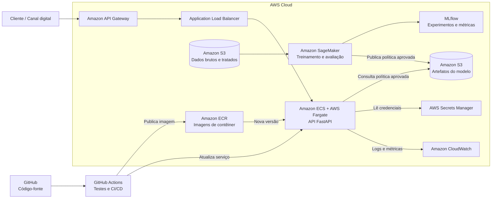

# datathon-7mlet-grupo-50 — Plataforma de Ofertas Adaptativas

Datathon 7MLET. **Visão do problema:** experimentação adaptativa para ofertas bancárias
usando multi-armed bandit.

Uma instituição financeira digital precisa decidir, em cada canal, qual oferta apresentar a
cada cliente elegível. Regras fixas e testes A/B longos desperdiçam tráfego e demoram a
reagir. A abordagem adaptativa (multi-armed bandit) equilibra exploração e explotação e
aprende com as respostas observadas.

**Base Kaggle:** [Bank Marketing](https://www.kaggle.com/datasets/henriqueyamahata/bank-marketing)
(versão 1, origem UCI). A coluna `duration` é descartada por vazamento temporal. Detalhes em
[`data/kaggle/README.md`](data/kaggle/README.md) e [`docs/data_dictionary.md`](docs/data_dictionary.md).

## Instruções de execução local

### Ambiente virtual

Pré-requisitos: Python 3.11, 3.12 ou 3.13 e o gerenciador de pacotes
[`uv`](https://docs.astral.sh/uv/getting-started/installation/).

Na raiz do repositório, execute:

```bash
uv sync --extra dev
```

O `uv` cria automaticamente o ambiente virtual em `.venv/` e instala as dependências
registradas em `pyproject.toml` e `uv.lock`. Não é necessário ativar o ambiente: os comandos
com `uv run` usam o `.venv` correto automaticamente.

Se preferir ativá-lo manualmente:

```bash
source .venv/bin/activate       # macOS/Linux
# .venv\Scripts\Activate.ps1    # Windows PowerShell

python --version
deactivate                     # encerra o ambiente quando terminar
```

### Pipeline completo

```bash
# baixa e extrai bank-additional-full.csv em data/kaggle/
uv run kaggle datasets download \
  -d henriqueyamahata/bank-marketing \
  -p data/kaggle \
  --unzip

uv run python -m datathon.data_loader  # prepara o Parquet usado no treino

uv run datathon-train            # Etapa 3 + 7: treina as políticas e registra no MLflow
uv run datathon-evaluate         # Etapa 4: métricas comparativas + relatório
uv run datathon-serve            # Etapa 5: sobe a API em http://127.0.0.1:8000
uv run mlflow ui                 # inspeciona parâmetros e métricas dos experimentos
uv run pytest                    # testes
```

O download pela CLI do Kaggle exige autenticação configurada. Depois do download, o comando
`datathon.data_loader` transforma `data/kaggle/bank-additional-full.csv` em
`data/processed/bank_marketing_processed.parquet`, arquivo usado pelo treino.

### Exemplo de chamada

```bash
curl -X POST "http://127.0.0.1:8000/recommend?seed=42" \
  -H "Content-Type: application/json" \
  -d '{"age": 35, "job": "student", "contact": "cellular", "month": "mar",
       "education": "university.degree", "housing": "no", "loan": "no",
       "default": "no", "poutcome": "success", "previous": 2}'
```

```json
{
  "arm_id": "arm_004",
  "arm_name": "LCI / LCA 90 dias",
  "channel": "app",
  "score": 0.7432,
  "algorithm": "contextual_thompson_sampling",
  "contextual": true
}
```

Documentação interativa em `http://127.0.0.1:8000/docs`. `GET /health` mostra qual política
está sendo servida e se ela veio do MLflow ou do arquivo local.

### Página de demonstração — `/demo`

`http://127.0.0.1:8000/demo` é uma página de apresentação servida pela própria API: os cinco
clientes da Etapa 4 como opções prontas, a oferta recomendada em linguagem de negócio, e a
crença da política sobre **cada** braço em barras — com quanta evidência sustenta cada uma.
O seletor de crença alterna entre a política publicada e o snapshot de 500 clientes, o que
mostra o mesmo algoritmo antes e depois de a exploração decair. O botão *Explorar 20×* chama
a API sem `seed` e conta as ofertas sorteadas.

Sem dependências externas: nada de CDN, tudo inline — a apresentação funciona offline. Para
o seletor de crença funcionar, gere o snapshot antes com
`uv run datathon-evaluate --write-golden`.

`GET /policy` expõe os mesmos dados em JSON, para quem quiser auditar a decisão sem a página.

### Reprodutibilidade — o parâmetro `seed`

Thompson Sampling decide sorteando da distribuição posterior de cada braço, então duas
chamadas idênticas podem devolver ofertas diferentes. O parâmetro opcional `seed` fixa esse
sorteio: com ele a resposta é sempre a mesma, o que torna possível ter casos de teste
congelados (o golden set da Etapa 4) e ensaiar a demo sabendo o que a API vai responder.

A seed é escolha de quem chama, não parte do que o modelo aprendeu — por isso ela não é
serializada no estado da política. Sem `seed`, cada chamada sorteia de novo, que é o
comportamento de produção.

Cada segmento acumula sua própria evidência. Dentro de um segmento, a exploração decai à
medida que os posteriors se concentram; entre segmentos, clientes com contextos diferentes
podem receber ofertas diferentes.

## Escolhas de design

| Escolha | Decisão | Porquê |
| --- | --- | --- |
| Algoritmo de produção | Thompson Sampling contextual | Mantém um posterior Beta por braço e segmento; usa o perfil na decisão sem parâmetro manual de exploração. |
| Baseline | Braço fixo de maior `base_conversion_rate` + escolha aleatória | É a decisão que um time de marketing tomaria olhando só a ficha técnica da oferta; o aleatório é o piso. |
| Contexto | **Contextual por segmento** | O perfil é mapeado para `previous_converter`, `student_digital`, `retired`, `low_engagement`, `digital_channel` ou `general`; cada grupo aprende sua distribuição por braço. |
| API | FastAPI | Validação por schema (Pydantic) e documentação OpenAPI automática. |
| Rastreamento | MLflow local | Ferramenta do curso; registra parâmetros, métricas e o artefato da política. |

### Resultado (20.000 clientes simulados)

| Estratégia | Conversão | Uplift vs baseline fixo |
| --- | --- | --- |
| **Thompson Sampling contextual** | **0.4139** | **+24.8%** |
| Thompson Sampling global | 0.4128 | +24.5% |
| UCB1 | 0.3922 | +18.2% |
| Epsilon-Greedy (0.10) | 0.3913 | +18.0% |
| Baseline fixo | 0.3317 | — |
| Baseline aleatório | 0.1850 | −44.2% |

Todos os algoritmos adaptativos superam o baseline. A versão contextual obteve a maior
conversão e mantém decisões diferentes por segmento. Reproduza com `uv run datathon-train`.

Estes números vêm da re-execução do ambiente da Etapa 3 pelas classes de política que a API
serve (`uv run datathon-train`), e é essa execução que fica registrada no MLflow. Diferem na
terceira casa dos do notebook 03 porque o notebook sorteia com `numpy.random` e as classes
usam `random.Random` — mesma conclusão, gerador diferente.

### Etapa 4 — avaliação e golden set

`uv run datathon-evaluate` refaz a comparação acima medindo, além da conversão e do uplift,
a **convergência**: para qual braço cada política migrou na segunda metade do horizonte e
com que concentração. Saída versionada em [`reports/etapa4_avaliacao.md`](reports/etapa4_avaliacao.md)
e num run MLflow (`avaliacao-etapa4`). Como todas as políticas enfrentam a mesma matriz de
desfechos (*common random numbers*), a diferença entre elas é decisão, não sorte.

Os **cinco casos golden** ficam em `tests/golden/`, congelados em dois momentos da vida da
política — o contraste entre os dois arquivos é o argumento da etapa:

| arquivo | treino | os 5 casos recebem |
| --- | --- | --- |
| `golden_set.json` | 20.000 clientes | ofertas estabilizadas por segmento |
| `golden_set_em_aprendizado.json` | 500 clientes | maior variação por exploração |

Cada arquivo guarda a impressão digital dos posteriors que o gerou. Se a política for
retreinada e a crença mudar, o teste falha pedindo `uv run datathon-evaluate --write-golden`
— mudou o modelo, mudou a recomendação, e o time vê antes de gravar o vídeo.

#### Cinco casos de teste

| Cliente | Segmento | Recomendação | Score | Por que faz sentido |
| --- | --- | --- | ---: | --- |
| Conversor anterior | `previous_converter` | LCI / LCA 90 dias | 0,7432 | O histórico positivo permite uma oferta de investimento com maior compromisso. |
| Estudante digital | `student_digital` | Poupança estudantil | 0,9394 | Produto e canal combinam com estágio de vida e comportamento digital. |
| Aposentado | `retired` | CDB liquidez diária | 0,8547 | Combina perfil conservador com liquidez e simplicidade. |
| Cliente digital de massa | `digital_channel` | CDB liquidez diária | 0,3993 | Oferta acessível pelo canal digital, sem prazo longo. |
| Baixo engajamento | `low_engagement` | CDB liquidez diária | 0,3993 | Oferta simples como próximo passo, em vez de um produto complexo. |

Os valores estão congelados em `tests/golden/golden_set.json`.

### Etapa 7 — evidência de MLOps

O experimento MLflow `datathon-ofertas-mab` registra parâmetros, conversão, uplift e o JSON
da política. A execução final produziu o run de treino
`1543f1d1fb814b5882bb4de401fec8cc` e o run de avaliação
`158ffe08bbcb4a3385f23db3c748598c`. O estado local do MLflow não é versionado; a evidência
reproduzível é o comando de treino, o relatório versionado e
`data/processed/policy_state.json`.

## Mapa de pastas

```
src/datathon/
├── bandits/            # políticas: base (interface), thompson, ucb, epsilon_greedy, baseline
├── training/           # ambiente de simulação + treino com rastreamento MLflow (Etapas 3 e 7)
├── evaluation/         # métricas comparativas + golden set (Etapa 4)
├── api/                # serviço FastAPI: recommender (domínio), policy_store (carga), main (HTTP)
│   └── static/demo.html    # página de apresentação servida em /demo (Etapa 8)
├── client_personas.py  # os 5 clientes fixos, compartilhados pelo golden set e pela demo
├── data_loader.py      # limpeza do dataset Kaggle (Etapa 2)
└── simulator.py        # geração dos eventos sintéticos de oferta/recompensa
notebooks/              # 01 EDA · 02 enriquecimento sintético · 03 baseline vs adaptativos
data/                   # kaggle (bruto) · processed (tratado + política) · synthetic_enrichment (catálogo)
tests/golden/           # os 5 casos congelados da Etapa 4
reports/                # relatório versionado da avaliação
```

## Governança, LGPD e limites de uso

A finalidade é experimentar ofertas para clientes previamente elegíveis, nunca decidir
crédito, preço, limite ou acesso a serviço essencial. A base legal e a comunicação ao titular
devem ser validadas pelo encarregado de dados. Identificadores diretos, renda, patrimônio e
atributos sensíveis não entram na política. Eventos detalhados devem ser retidos somente pelo
período aprovado e depois agregados ou eliminados.

Decisões sensíveis permanecem com humano no loop. Devem ser monitoradas conversão por segmento,
taxa de exploração, distribuição de ofertas, latência, erros e mudanças de composição. Queda de
conversão, concentração anormal, ausência de feedback ou disparidade relevante exige pausar a
política e voltar ao baseline fixo. As recompensas são simuladas e não provam causalidade nem
desempenho real; produção exige experimento controlado, revisão jurídica, teste de vieses e
limites de frequência de contato.

## Etapa 8 — roteiro do vídeo (até 5 minutos)

1. **0:00–0:40:** problema de negócio e limitações de regras fixas/testes A/B longos.
2. **0:40–1:15:** base Kaggle, remoção de `duration` e preparação dos 41.176 registros.
3. **1:15–2:10:** baseline 0,3317 versus Thompson contextual 0,4139 (+24,8%).
4. **2:10–3:30:** abrir `/demo`, executar três personas e explicar os segmentos.
5. **3:30–4:15:** abrir o MLflow e mostrar parâmetros, métricas e artefato.
6. **4:15–5:00:** arquitetura AWS, limites, humano no loop e próximos passos.

**Link do vídeo:** adicionar aqui antes da submissão.

## Etapa 6 — Arquitetura-alvo em nuvem (AWS)

Em produção, os dados de campanhas e as respostas dos clientes poderão ser armazenados no **Amazon S3**, mantendo separadas as camadas de dados brutos, tratados e os artefatos dos modelos. O treinamento e a avaliação das políticas de recomendação seriam executados no **Amazon SageMaker**, com o **MLflow** registrando parâmetros, métricas e versões dos experimentos. Após a validação, a aplicação e a política aprovada seriam empacotadas em uma imagem de contêiner e publicadas no **Amazon Elastic Container Registry (ECR)**.

A API FastAPI seria executada no **Amazon ECS com AWS Fargate**, permitindo escalar o serviço de recomendação sem administrar servidores, e seria exposta de forma segura pelo **Amazon API Gateway**. Segredos e credenciais ficariam no **AWS Secrets Manager**, sem serem incluídos no código. Logs, latência, erros e métricas de negócio, como conversão, recompensa média e distribuição das ofertas, seriam acompanhados pelo **Amazon CloudWatch**. O fluxo de integração e entrega contínua poderia ser automatizado com **GitHub Actions**, executando os testes antes de publicar uma nova imagem no ECR e atualizar o serviço no ECS.


