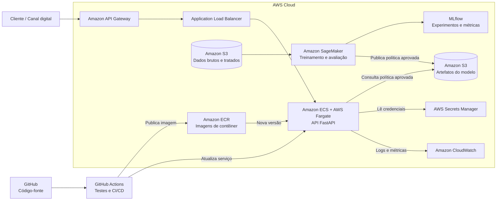

# datathon-7mlet-grupo-50 — Plataforma de Ofertas Adaptativas

Datathon 7MLET. **Visão do problema:** experimentação adaptativa para ofertas bancárias
usando multi-armed bandit.

Uma instituição financeira digital precisa decidir, em cada canal, qual oferta apresentar a
cada cliente elegível. Regras fixas e testes A/B longos desperdiçam tráfego e demoram a
reagir. A abordagem adaptativa (multi-armed bandit) equilibra exploração e explotação e
aprende com as respostas observadas.

**Base Kaggle:** [Bank Marketing](https://www.kaggle.com/code/henriqueyamahata/bank-marketing-classification-roc-f1-recall)
(origem UCI). A coluna `duration` é descartada por vazamento temporal. Detalhes em
[`data/kaggle/README.md`](data/kaggle/README.md) e [`docs/data_dictionary.md`](docs/data_dictionary.md).

## Instruções de execução local

```bash
uv sync --extra dev              # dependências

uv run datathon-train            # Etapa 3 + 7: treina as políticas e registra no MLflow
uv run datathon-evaluate         # Etapa 4: métricas comparativas + relatório
uv run datathon-serve            # Etapa 5: sobe a API em http://127.0.0.1:8000
uv run mlflow ui                 # inspeciona parâmetros e métricas dos experimentos
uv run pytest                    # testes
```

`datathon-train` precisa de `data/processed/bank_marketing_processed.parquet` — gere-o antes
com `uv run python -m datathon.data_loader` (requer o CSV do Kaggle em `data/kaggle/`).

### Exemplo de chamada

```bash
curl -X POST "http://127.0.0.1:8000/recommend?seed=42" \
  -H "Content-Type: application/json" \
  -d '{"age": 35, "job": "student", "contact": "cellular", "month": "mar",
       "education": "university.degree", "housing": "no", "loan": "no",
       "default": "no", "poutcome": "success", "previous": 2}'
```

```json
{
  "arm_id": "arm_005",
  "arm_name": "CDB liquidez diária",
  "channel": ["app", "push"],
  "score": 0.4172,
  "algorithm": "thompson_sampling",
  "contextual": false
}
```

Documentação interativa em `http://127.0.0.1:8000/docs`. `GET /health` mostra qual política
está sendo servida e se ela veio do MLflow ou do arquivo local.

### Página de demonstração — `/demo`

`http://127.0.0.1:8000/demo` é uma página de apresentação servida pela própria API: os cinco
clientes da Etapa 4 como opções prontas, a oferta recomendada em linguagem de negócio, e a
crença da política sobre **cada** braço em barras — com quanta evidência sustenta cada uma.
O seletor de crença alterna entre a política publicada e o snapshot de 500 clientes, o que
mostra o mesmo algoritmo antes e depois de a exploração decair. O botão *Explorar 20×* chama
a API sem `seed` e conta as ofertas sorteadas.

Sem dependências externas: nada de CDN, tudo inline — a apresentação funciona offline. Para
o seletor de crença funcionar, gere o snapshot antes com
`uv run datathon-evaluate --write-golden`.

`GET /policy` expõe os mesmos dados em JSON, para quem quiser auditar a decisão sem a página.

### Reprodutibilidade — o parâmetro `seed`

Thompson Sampling decide sorteando da distribuição posterior de cada braço, então duas
chamadas idênticas podem devolver ofertas diferentes. O parâmetro opcional `seed` fixa esse
sorteio: com ele a resposta é sempre a mesma, o que torna possível ter casos de teste
congelados (o golden set da Etapa 4) e ensaiar a demo sabendo o que a API vai responder.

A seed é escolha de quem chama, não parte do que o modelo aprendeu — por isso ela não é
serializada no estado da política. Sem `seed`, cada chamada sorteia de novo, que é o
comportamento de produção.

Vale saber o que esperar: como a política já viu 20.000 clientes, a crença sobre `arm_005`
está concentrada e o sorteio quase sempre cai nele. **Isso é a exploração decaindo com a
evidência acumulada — a propriedade central do Thompson Sampling**, não ausência de
exploração. Uma política recém-inicializada (Beta(1,1) em todos os braços) alterna bastante
entre eles; a treinada converge.

## Escolhas de design

| Escolha | Decisão | Porquê |
| --- | --- | --- |
| Algoritmo de produção | Thompson Sampling | Sem hiperparâmetro de exploração para calibrar; a exploração decai sozinha com a evidência acumulada. Foi o melhor no comparativo abaixo. |
| Baseline | Braço fixo de maior `base_conversion_rate` + escolha aleatória | É a decisão que um time de marketing tomaria olhando só a ficha técnica da oferta; o aleatório é o piso. |
| Contexto | **Não-contextual** | Um posterior Beta(α, β) por braço, agregado sobre a população. A alternativa — posteriors por (braço × segmento) — multiplicaria 9 braços por 10 segmentos sobrepostos, deixando cada célula esparsa; e a Etapa 3 mostrou os três algoritmos adaptativos convergindo para o **mesmo** braço na população, ou seja, o ganho contextual não se manifestou neste ambiente. |
| API | FastAPI | Validação por schema (Pydantic) e documentação OpenAPI automática. |
| Rastreamento | MLflow local | Ferramenta do curso; registra parâmetros, métricas e o artefato da política. |

### Resultado (20.000 clientes simulados)

| Estratégia | Conversão | Uplift vs baseline fixo |
| --- | --- | --- |
| **Thompson Sampling** | **0.4128** | **+24.5%** |
| UCB1 | 0.3922 | +18.2% |
| Epsilon-Greedy (0.10) | 0.3913 | +18.0% |
| Baseline fixo | 0.3317 | — |
| Baseline aleatório | 0.1850 | −44.2% |

Os três algoritmos adaptativos convergem para o mesmo braço (`arm_005`), e todos superam o
baseline. Reproduza com `uv run datathon-train`.

Estes números vêm da re-execução do ambiente da Etapa 3 pelas classes de política que a API
serve (`uv run datathon-train`), e é essa execução que fica registrada no MLflow. Diferem na
terceira casa dos do notebook 03 porque o notebook sorteia com `numpy.random` e as classes
usam `random.Random` — mesma conclusão, gerador diferente.

### Etapa 4 — avaliação e golden set

`uv run datathon-evaluate` refaz a comparação acima medindo, além da conversão e do uplift,
a **convergência**: para qual braço cada política migrou na segunda metade do horizonte e
com que concentração. Saída em `reports/etapa4_avaliacao.md` (gerado localmente, fora do versionamento)
e num run MLflow (`avaliacao-etapa4`). Como todas as políticas enfrentam a mesma matriz de
desfechos (*common random numbers*), a diferença entre elas é decisão, não sorte.

Os **cinco casos golden** ficam em `tests/golden/`, congelados em dois momentos da vida da
política — o contraste entre os dois arquivos é o argumento da etapa:

| arquivo | treino | os 5 casos recebem |
| --- | --- | --- |
| `golden_set.json` | 20.000 clientes (política publicada) | a **mesma** oferta — a exploração cessou |
| `golden_set_em_aprendizado.json` | 500 clientes | ofertas **diferentes** — exploração viva |

Cada arquivo guarda a impressão digital dos posteriors que o gerou. Se a política for
retreinada e a crença mudar, o teste falha pedindo `uv run datathon-evaluate --write-golden`
— mudou o modelo, mudou a recomendação, e o time vê antes de gravar o vídeo.

> **Ressalva de honestidade:** a política de produção é não-contextual. A API recebe e
> registra os dados do cliente (exigência da Etapa 5), mas eles **não** alteram a oferta
> escolhida — a recomendação vem da crença populacional. Dois clientes diferentes podem
> receber a mesma oferta. O contexto entra no *ambiente de recompensa* da simulação, via os
> `segment_multipliers` do catálogo, não na política. Uma versão contextual continua sendo a
> evolução natural: `BanditPolicy.select_arm()` já recebe `context`, e uma política nova pode
> ser registrada sem quebrar a existente.

## Mapa de pastas

```
src/datathon/
├── bandits/            # políticas: base (interface), thompson, ucb, epsilon_greedy, baseline
├── training/           # ambiente de simulação + treino com rastreamento MLflow (Etapas 3 e 7)
├── evaluation/         # métricas comparativas + golden set (Etapa 4)
├── api/                # serviço FastAPI: recommender (domínio), policy_store (carga), main (HTTP)
│   └── static/demo.html    # página de apresentação servida em /demo (Etapa 8)
├── client_personas.py  # os 5 clientes fixos, compartilhados pelo golden set e pela demo
├── data_loader.py      # limpeza do dataset Kaggle (Etapa 2)
└── simulator.py        # geração dos eventos sintéticos de oferta/recompensa
notebooks/              # 01 EDA · 02 enriquecimento sintético · 03 baseline vs adaptativos
data/                   # kaggle (bruto) · processed (tratado + política) · synthetic_enrichment (catálogo)
tests/golden/           # os 5 casos congelados da Etapa 4
reports/                # relatório de avaliação gerado por datathon-evaluate (fora do git)
```

## Etapa 6 — Arquitetura-alvo em nuvem (AWS)

Em produção, os dados de campanhas e as respostas dos clientes poderão ser armazenados no **Amazon S3**, mantendo separadas as camadas de dados brutos, tratados e os artefatos dos modelos. O treinamento e a avaliação das políticas de recomendação seriam executados no **Amazon SageMaker**, com o **MLflow** registrando parâmetros, métricas e versões dos experimentos. Após a validação, a aplicação e a política aprovada seriam empacotadas em uma imagem de contêiner e publicadas no **Amazon Elastic Container Registry (ECR)**.

A API FastAPI seria executada no **Amazon ECS com AWS Fargate**, permitindo escalar o serviço de recomendação sem administrar servidores, e seria exposta de forma segura pelo **Amazon API Gateway**. Segredos e credenciais ficariam no **AWS Secrets Manager**, sem serem incluídos no código. Logs, latência, erros e métricas de negócio, como conversão, recompensa média e distribuição das ofertas, seriam acompanhados pelo **Amazon CloudWatch**. O fluxo de integração e entrega contínua poderia ser automatizado com **GitHub Actions**, executando os testes antes de publicar uma nova imagem no ECR e atualizar o serviço no ECS.


