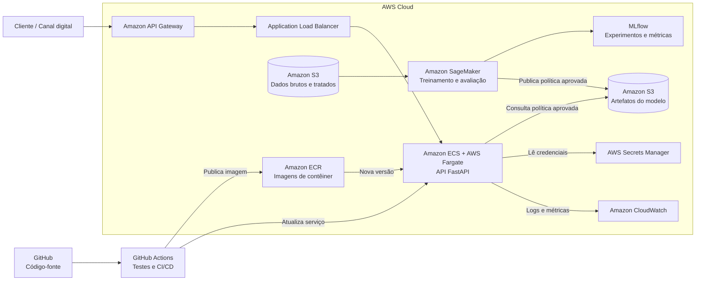

# datathon-7mlet-grupo-50
Datathon 7MLET

Visão do Problema: plataforma de experimentação adaptativa para ofertas bancárias usando multi-armed bandit, com assistente LLM via RAG

Escopo e escolhas de design: quais algoritmos foram escolhidos e por quê, qual dataset Kaggle foi usado, qual framework de API foi escolhido (ex: FastAPI), qual ferramenta de rastreamento (MLflow).

Mapa de pastas — a árvore de diretórios comentada, explicando o que cada pasta contém.

## Etapa 6 — Arquitetura-alvo em nuvem (AWS)

Em produção, os dados de campanhas e as respostas dos clientes poderão ser armazenados no **Amazon S3**, mantendo separadas as camadas de dados brutos, tratados e os artefatos dos modelos. O treinamento e a avaliação das políticas de recomendação seriam executados no **Amazon SageMaker**, com o **MLflow** registrando parâmetros, métricas e versões dos experimentos. Após a validação, a aplicação e a política aprovada seriam empacotadas em uma imagem de contêiner e publicadas no **Amazon Elastic Container Registry (ECR)**.

A API FastAPI seria executada no **Amazon ECS com AWS Fargate**, permitindo escalar o serviço de recomendação sem administrar servidores, e seria exposta de forma segura pelo **Amazon API Gateway**. Segredos e credenciais ficariam no **AWS Secrets Manager**, sem serem incluídos no código. Logs, latência, erros e métricas de negócio, como conversão, recompensa média e distribuição das ofertas, seriam acompanhados pelo **Amazon CloudWatch**. O fluxo de integração e entrega contínua poderia ser automatizado com **GitHub Actions**, executando os testes antes de publicar uma nova imagem no ECR e atualizar o serviço no ECS.

