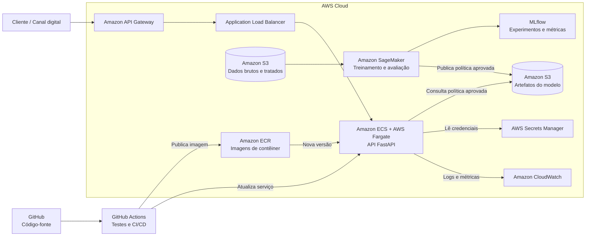

# datathon-7mlet-grupo-58 — Plataforma de Ofertas Adaptativas

Datathon 7MLET. **Visão do problema:** experimentação adaptativa para ofertas bancárias
usando multi-armed bandit.

Uma instituição financeira digital precisa decidir, em cada canal, qual oferta apresentar a
cada cliente elegível. Regras fixas e testes A/B longos desperdiçam tráfego e demoram a
reagir. A abordagem adaptativa (multi-armed bandit) equilibra exploração e explotação e
aprende com as respostas observadas.

**Base Kaggle:** [Bank Marketing](https://www.kaggle.com/datasets/henriqueyamahata/bank-marketing)
(versão 1, origem UCI). A coluna `duration` é descartada por vazamento temporal. Detalhes em
[`data/kaggle/README.md`](data/kaggle/README.md) e [`docs/data_dictionary.md`](docs/data_dictionary.md).

## Instruções de execução local

### Ambiente virtual

Pré-requisitos: Python 3.11, 3.12 ou 3.13 e o gerenciador de pacotes
[`uv`](https://docs.astral.sh/uv/getting-started/installation/).

Na raiz do repositório, execute:

```bash
uv sync --extra dev
```

O `uv` cria automaticamente o ambiente virtual em `.venv/` e instala as dependências
registradas em `pyproject.toml` e `uv.lock`. Não é necessário ativar o ambiente: os comandos
com `uv run` usam o `.venv` correto automaticamente.

Se preferir ativá-lo manualmente:

```bash
source .venv/bin/activate       # macOS/Linux
# .venv\Scripts\Activate.ps1    # Windows PowerShell

python --version
deactivate                     # encerra o ambiente quando terminar
```

### Pipeline completo

```bash
# baixa e extrai bank-additional-full.csv em data/kaggle/
uv run kaggle datasets download \
  -d henriqueyamahata/bank-marketing \
  -p data/kaggle \
  --unzip

uv run python -m datathon.data_loader  # prepara o Parquet usado no treino

uv run datathon-train            # Etapa 3 + 7: treina as políticas e registra no MLflow
uv run datathon-evaluate         # Etapa 4: métricas comparativas + relatório
uv run datathon-serve            # Etapa 5: sobe a API em http://127.0.0.1:8000
uv run mlflow ui                 # inspeciona parâmetros e métricas dos experimentos
uv run pytest                    # testes
```

O download pela CLI do Kaggle exige autenticação configurada. Depois do download, o comando
`datathon.data_loader` transforma `data/kaggle/bank-additional-full.csv` em
`data/processed/bank_marketing_processed.parquet`, arquivo usado pelo treino.

### Exemplo de chamada

```bash
curl -X POST "http://127.0.0.1:8000/recommend?seed=42" \
  -H "Content-Type: application/json" \
  -d '{"age": 35, "job": "student", "contact": "cellular", "month": "mar",
       "education": "university.degree", "housing": "no", "loan": "no",
       "default": "no", "poutcome": "success", "previous": 2}'
```

```json
{
  "arm_id": "arm_004",
  "arm_name": "LCI / LCA 90 dias",
  "channel": "app",
  "score": 0.7432,
  "segment": "previous_converter",
  "algorithm": "contextual_thompson_sampling",
  "contextual": true
}
```

Documentação interativa em `http://127.0.0.1:8000/docs`. `GET /health` mostra qual política
está sendo servida e se ela veio do MLflow ou do arquivo local. `GET /` redireciona para
`/demo` — abrir a raiz do serviço sem saber a rota exata não bate mais em 404.

### Página de demonstração — `/demo`

`http://127.0.0.1:8000/demo` é uma página de apresentação servida pela própria API, sempre
pela política publicada (20.000 clientes). Ao clicar em *Recomendar*, a resposta aparece em
dois passos, nessa ordem — Passo 1 de 2 (segmento) acima do Passo 2 de 2 (oferta), ligados
por uma seta na tela — porque é a ordem real da decisão: atributos decidem o segmento, o
segmento decide a oferta.

1. **Cliente.** Um formulário com 10 campos de **perfil** — idade, ocupação, estado civil,
   educação, default, financiamento, empréstimo, canal, contatos anteriores e resultado da
   campanha anterior. De propósito, fica de fora `month`, `day_of_week` e `campaign`: eles
   descrevem o contato em si (quando ele acontece, em que ponto da campanha atual), não um
   fato sobre o cliente. A API continua aceitando os três para quem chamar `/recommend`
   diretamente, com o valor padrão do schema.

   Os 4 campos marcados com **●** — ocupação, canal, contatos anteriores e resultado da
   campanha anterior — são exatamente os que `context_segment()` usa para decidir o segmento;
   os demais aparecem no formulário, mas ainda não influenciam a recomendação com a política
   atual — mostrado na tela, não escondido: é uma limitação documentada do segmento
   contextual de hoje, não um bug do formulário.

   Os cinco casos golden da Etapa 4 aparecem como *presets* no seletor "Cliente" — escolher
   um preenche o formulário inteiro. Editar qualquer campo troca automaticamente para
   **Personalizado** e o selo muda de `🔒 caso golden set testado` para `🧪 exploração livre
   — fora do golden set`: o formulário continua funcionando, só deixa de ser um caso
   protegido por teste.
2. **Oferta recomendada**, com a crença da política sobre **cada** braço do segmento em
   barras — quanta evidência sustenta cada uma. O botão *Explorar 20×* chama a API 20 vezes
   sem fixar a seed — a política sorteia de verdade a cada chamada — e conta quantas vezes
   cada oferta saiu, provando ao vivo que a exploração é real.

A demo serve só a política publicada — não há seletor de crenças. A evidência de decadência
da exploração ao longo do treino fica em `reports/etapa4_avaliacao.md` (coluna
"concentração", para todas as políticas).

A seed usada em cada chamada também não aparece mais na tela — é um parâmetro técnico sem
explicação de negócio (ver "Reprodutibilidade" abaixo); continua sendo enviada por baixo dos
panos, e dá para conferir no painel "Resposta crua da API", que mostra a URL completa da
chamada com `?seed=`.

`GET /policy` expõe a crença em JSON, para quem quiser auditar a decisão sem a página.

### Loop de feedback — `POST /outcome`

`POST /recommend` devolve, além da oferta, um `recommendation_id`. É esse id — não o
`arm_id` — que fecha o loop: `POST /outcome` recebe `{"recommendation_id": "...",
"accepted": true|false}` e atualiza o posterior Beta do braço e segmento que aquela
recomendação específica usou, com `1.0` de recompensa se o cliente aceitou e `0.0` se
recusou. Cada `recommendation_id` só pode ser resolvido uma vez — a segunda tentativa (ou um
id desconhecido) devolve `404`, para não contar o mesmo desfecho duas vezes.

O segmento vem de onde a recomendação foi decidida, guardado num log em memória no momento
do `/recommend` — nunca recalculado do estado atual da política. Isso corrige um bug que
existia antes deste endpoint: a política contextual guardava o último segmento visto
(`_last_segment`) e o usaria em `update()`; sob chamadas concorrentes, uma segunda
recomendação (de outro cliente, outro segmento) podia sobrescrever esse valor antes do
desfecho da primeira chegar, atualizando o braço errado. `record_outcome()` sempre passa o
segmento explicitamente agora.

Na página `/demo`, cada recomendação vem com os botões "Cliente aceitou" / "Cliente
recusou"; clicar chama `/outcome` e redesenha as barras de crença com o posterior já
atualizado. Como a política publicada tem milhares de observações acumuladas em alguns
braços (ver `data/processed/policy_state.json`), um clique isolado quase não move o
posterior nesses casos — por isso a demo também tem "Recusar 20×", que recomenda e recusa 20
vezes seguidas sem seed, tornando visível a política migrando de braço em segmentos com
pouca evidência acumulada.

Esse estado atualizado só existe na memória do processo da API — não é regravado em
`policy_state.json` nem no MLflow (ver "Limitações conhecidas").

### Reprodutibilidade — o parâmetro `seed`

Thompson Sampling decide sorteando da distribuição posterior de cada braço, então duas
chamadas idênticas podem devolver ofertas diferentes. O parâmetro opcional `seed` fixa esse
sorteio: com ele a resposta é sempre a mesma, o que torna possível ter casos de teste
congelados (o golden set da Etapa 4) e ensaiar a demo sabendo o que a API vai responder.

A seed é escolha de quem chama, não parte do que o modelo aprendeu — por isso ela não é
serializada no estado da política. Sem `seed`, cada chamada sorteia de novo, que é o
comportamento de produção.

As cinco personas do golden set compartilham a mesma seed — `GOLDEN_SEED = 42`, definida em
`client_personas.py` — e o modo Personalizado da demo usa a mesma constante
(`DEFAULT_CUSTOM_SEED = 42` em `demo.html`). De propósito: a seed não é parâmetro do modelo,
é só o sorteio dentro do segmento. Se cada persona tivesse uma seed diferente (como era
antes), uma eventual diferença de oferta entre duas personas poderia ser por causa do
sorteio, não do perfil. Com a seed igual para todas, sobra só uma explicação possível: o
segmento — o argumento de personalização fica limpo.

A página `/demo` não mostra a seed — de propósito. É um parâmetro técnico de
reprodutibilidade, não uma alavanca de negócio; mostrar um número que ninguém consegue
explicar só distrai da história (segmento → oferta). Ela continua sendo enviada em toda
chamada (visível na URL do painel "Resposta crua da API"). Para testar outra seed: mude
`GOLDEN_SEED` em `client_personas.py` (regrava o golden set com `uv run datathon-evaluate
--write-golden`) ou `DEFAULT_CUSTOM_SEED` em `demo.html`, ou chame a API diretamente com
`?seed=`.

Cada segmento acumula sua própria evidência. Dentro de um segmento, a exploração decai à
medida que os posteriors se concentram; entre segmentos, clientes com contextos diferentes
podem receber ofertas diferentes.

## Escolhas de design

| Escolha | Decisão | Porquê |
| --- | --- | --- |
| Algoritmo de produção | Thompson Sampling contextual | Mantém um posterior Beta por braço e segmento; usa o perfil na decisão sem parâmetro manual de exploração. |
| Baseline | Braço fixo de maior `base_conversion_rate` + escolha aleatória | É a decisão que um time de marketing tomaria olhando só a ficha técnica da oferta; o aleatório é o piso. |
| Contexto | **Contextual por segmento** | O perfil é mapeado para `previous_converter`, `student_digital`, `retired`, `low_engagement`, `digital_channel` ou `general`; cada grupo aprende sua distribuição por braço. |
| API | FastAPI | Validação por schema (Pydantic) e documentação OpenAPI automática. |
| Rastreamento | MLflow local | Ferramenta do curso; registra parâmetros, métricas e o artefato da política. |

### Resultado (20.000 clientes simulados)

| Estratégia | Conversão | Uplift vs baseline fixo |
| --- | --- | --- |
| **Thompson Sampling contextual** | **0.4139** | **+24.8%** |
| Thompson Sampling global | 0.4128 | +24.5% |
| UCB1 | 0.3922 | +18.2% |
| Epsilon-Greedy (0.10) | 0.3913 | +18.0% |
| Baseline fixo | 0.3317 | — |
| Baseline aleatório | 0.1850 | −44.2% |

Todos os algoritmos adaptativos superam o baseline. A versão contextual obteve a maior
conversão e mantém decisões diferentes por segmento. Reproduza com `uv run datathon-train`.

Estes números vêm da re-execução do ambiente da Etapa 3 pelas classes de política que a API
serve (`uv run datathon-train`), e é essa execução que fica registrada no MLflow. O notebook 03
implementa a variante **não-contextual** (Thompson global, um Beta por braço, sem segmento na
decisão) — é com ela que os números abaixo são comparáveis. A versão **contextual**, eleita para
produção, só existe nas classes de `src/datathon/bandits/` e é avaliada por `uv run
datathon-train` / `datathon-evaluate`, não dentro do notebook.

Baseline fixo, Thompson (global), UCB1 e Epsilon-Greedy do notebook batem com os valores abaixo
na 3ª/4ª casa decimal — a pequena diferença vem de o notebook sortear com `numpy.random` e as
classes usarem `random.Random`, dois geradores diferentes mesmo com a mesma seed. O **baseline
aleatório** diverge mais (2ª casa, ~3,6 p.p.): é a única política que nunca converge — permanece
uniforme entre braços com taxas bem diferentes o horizonte inteiro — então a média final é
sensível à sequência exata de sorteios, e não só à seed. As demais convergem para o mesmo braço
dominante e por isso são estáveis entre notebook e código.

### Avaliação e golden set

`uv run datathon-evaluate` refaz a comparação acima medindo, além da conversão e do uplift,
a **convergência**: para qual braço cada política migrou na segunda metade do horizonte e
com que concentração. Saída versionada em [`reports/etapa4_avaliacao.md`](reports/etapa4_avaliacao.md)
e num run MLflow (`avaliacao-etapa4`). Como todas as políticas enfrentam a mesma matriz de
desfechos (*common random numbers*), a diferença entre elas é decisão, não sorte.

Os **cinco casos golden** ficam em `tests/golden/golden_set.json`, congelados a partir da
política publicada (20.000 clientes de treino) — os cinco recebem ofertas estabilizadas por
segmento.

O arquivo guarda a impressão digital dos posteriors que o gerou. Se a política for
retreinada e a crença mudar, o teste falha pedindo `uv run datathon-evaluate --write-golden`
— mudou o modelo, mudou a recomendação, e o time vê antes de gravar o vídeo.

#### Cinco casos de teste

| Cliente | Segmento | Recomendação | Score | Por que faz sentido |
| --- | --- | --- | ---: | --- |
| Conversor anterior | `previous_converter` | LCI / LCA 90 dias | 0,7432 | O histórico positivo permite uma oferta de investimento com maior compromisso. |
| Estudante digital | `student_digital` | Poupança estudantil | 0,9394 | Produto e canal combinam com estágio de vida e comportamento digital. |
| Aposentado | `retired` | CDB liquidez diária | 0,8547 | Combina perfil conservador com liquidez e simplicidade. |
| Cliente digital de massa | `digital_channel` | Poupança estudantil | 0,3075 | Maior multiplicador do catálogo para este segmento (1,8×) — o nome sugere público estudantil, mas o catálogo não restringe por idade. |
| Baixo engajamento | `low_engagement` | CDB liquidez diária | 0,3993 | Oferta simples como próximo passo, em vez de um produto complexo. |

Os valores estão congelados em `tests/golden/golden_set.json`.

### Evidência de MLOps

O experimento MLflow `datathon-ofertas-mab` registra parâmetros, conversão, uplift e o JSON
da política. A execução final produziu o run de treino
`1543f1d1fb814b5882bb4de401fec8cc` e o run de avaliação
`158ffe08bbcb4a3385f23db3c748598c`. O estado local do MLflow não é versionado; a evidência
reproduzível é o comando de treino, o relatório versionado e
`data/processed/policy_state.json`.

## Mapa de pastas

```
src/datathon/
├── bandits/            # políticas: base (interface), thompson, ucb, epsilon_greedy, baseline
├── training/           # ambiente de simulação + treino com rastreamento MLflow (Etapas 3 e 7)
├── evaluation/         # métricas comparativas + golden set (Etapa 4)
├── api/                # serviço FastAPI: recommender (domínio), policy_store (carga), main (HTTP)
│   └── static/demo.html    # página de apresentação servida em /demo (Etapa 8)
├── client_personas.py  # os 5 clientes fixos, compartilhados pelo golden set e pela demo
├── data_loader.py      # limpeza do dataset Kaggle (Etapa 2)
└── simulator.py        # geração dos eventos sintéticos de oferta/recompensa
notebooks/              # 01 EDA · 02 enriquecimento sintético · 03 baseline vs adaptativos
data/                   # kaggle (bruto) · processed (tratado + política) · synthetic_enrichment (catálogo)
tests/golden/           # os 5 casos congelados da Etapa 4
reports/                # relatório versionado da avaliação
```

## Limitações conhecidas e sugestões de melhoria

O contextual de hoje resolve o problema do datathon, mas é deliberadamente simples. Registrar
os limites aqui é mais honesto do que deixar a demo parecer mais sofisticada do que é.

| Limitação | Por que acontece | Sugestão de melhoria |
| --- | --- | --- |
| A personalização, na prática, depende de só 2 dos 13 campos do cliente (`job` e `contact`) | `context_segment()` (`src/datathon/bandits/contextual_thompson.py`) é uma cadeia de regras `if/elif`: só `poutcome`, `job`, `contact` e `previous`/`contacted_before` participam da decisão; `age`, `marital`, `education`, `default`, `housing` e `loan` são aceitos pela API mas nunca mudam o segmento — a própria tela `/demo` já avisa disso. | Substituir a segmentação por regras fixas por um bandit contextual genuíno (ex.: LinUCB ou Thompson com regressão logística) que aprenda o peso de cada atributo, em vez de decidir manualmente quais 4 campos importam. |
| Dentro de `job`, só `student` e `retired` têm tratamento próprio | As outras 10 categorias do dataset (`admin.`, `blue-collar`, `entrepreneur`, `housemaid`, `management`, `self-employed`, `services`, `technician`, `unemployed`, `unknown`) caem todas no mesmo braço da regra (`digital_channel` ou `general`, dependendo só do canal) — nenhuma diferença de oferta entre um `management` e um `unemployed`. | Ampliar a árvore de segmentos (ou trocar por um modelo que use `job` como variável categórica completa) para capturar as diferenças de comportamento que já existem nos dados brutos (ver `docs/data_dictionary.md`). |
| `digital_channel` sempre recomenda a mesma oferta (Poupança estudantil) | É o braço vencedor do segmento no `golden_set.json` — não porque o produto faça sentido para o perfil, mas porque o catálogo simulado (`offer_catalog.json`) não restringe elegibilidade por idade/ocupação; o multiplicador de segmento é a única coisa que discrimina os braços. | Adicionar regras de elegibilidade por produto no catálogo (ex.: "Poupança estudantil" exige `job=student`), para que o bandit escolha apenas entre ofertas plausíveis para aquele perfil. |
| ~82% dos clientes caem no segmento `low_engagement`, um "balde" único | `previous == 0` cobre a maior parte da base amostrada; é a primeira regra de exclusão a disparar para quem nunca converteu antes. Reproduzido na seção 11 do `notebooks/03_baseline_e_thompson_sampling.ipynb`: segmentar traz uma diferença agregada de conversão pequena (~0,04%) sobre o Thompson global, porque um segmento dominante domina a média. | Quebrar `low_engagement` em sub-segmentos (ex.: por faixa etária, educação ou mês de contato) para que a maioria da base também se beneficie da personalização, não só as minorias (`student_digital`, `retired`, `digital_channel`). |
| Os 6 segmentos são mutuamente exclusivos, por prioridade de regra | Um cliente que é `retired` **e** `student_digital` **e** teria `previous_converter` só conta para o primeiro que casar na cadeia `if/elif` — as outras evidências são descartadas, não combinadas. | Modelo aditivo (ex.: features binárias por regra, com um bandit linear) em vez de segmento único, para não perder informação de clientes que ativam mais de uma regra. |
| O loop de feedback só vive na memória do processo | `POST /outcome` (ver "Loop de feedback" abaixo) já atualiza `alpha`/`beta` do segmento e braço servidos, mas só no objeto em memória — nada é regravado em disco/MLflow. Reiniciar a API volta para a política publicada, e múltiplas réplicas (ex.: várias tasks ECS) não compartilhariam esse aprendizado entre si. | Persistir o estado atualizado (ex.: reescrever `policy_state.json` com lock, ou mover para um store compartilhado) para que o aprendizado online sobreviva a um restart e escale além de um único processo. |
| Catálogo de 8 das 9 ofertas é estimativa de negócio, não medida | O dataset Kaggle mede conversão real para **um** produto (depósito a prazo); as taxas base e multiplicadores das outras 8 ofertas em `offer_catalog.json` foram definidos por julgamento de negócio, não observados. | Validar (ou recalibrar) os parâmetros do catálogo com um piloto controlado antes de qualquer decisão real; tratar os números atuais como hipótese, não medição. |


## Arquitetura-alvo em nuvem (AWS)

Em produção, os dados de campanhas e as respostas dos clientes poderão ser armazenados no **Amazon S3**, mantendo separadas as camadas de dados brutos, tratados e os artefatos dos modelos. O treinamento e a avaliação das políticas de recomendação seriam executados no **Amazon SageMaker**, com o **MLflow** registrando parâmetros, métricas e versões dos experimentos. Após a validação, a aplicação e a política aprovada seriam empacotadas em uma imagem de contêiner e publicadas no **Amazon Elastic Container Registry (ECR)**.

A API FastAPI seria executada no **Amazon ECS com AWS Fargate**, permitindo escalar o serviço de recomendação sem administrar servidores, e seria exposta de forma segura pelo **Amazon API Gateway**. Segredos e credenciais ficariam no **AWS Secrets Manager**, sem serem incluídos no código. Logs, latência, erros e métricas de negócio, como conversão, recompensa média e distribuição das ofertas, seriam acompanhados pelo **Amazon CloudWatch**. O fluxo de integração e entrega contínua poderia ser automatizado com **GitHub Actions**, executando os testes antes de publicar uma nova imagem no ECR e atualizar o serviço no ECS.


